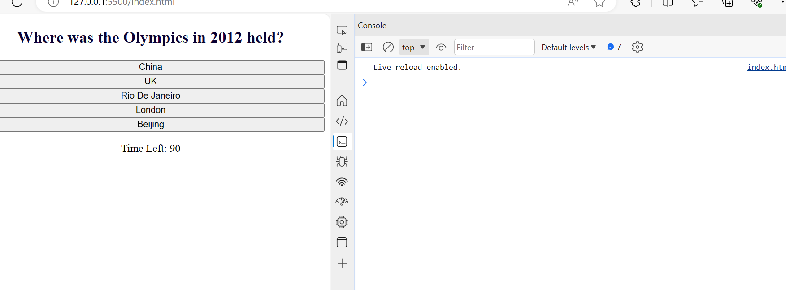

# Code-Quiz-Challenge
The purpose is to build a code-quiz with a multiple-choice options using HTML and CSS properties for the layout and design while Javascript for the logic and dynamic of the quiz content.

## Table of Contents

* Instruction page
* Question page
* Options
* Score and details page

## Features

* Set of Questions
* Multiple-Choice Options
* Timer Counterdown

## Screenshot of the results

## Link to page

https://aod4141.github.io/code-quiz-project/

## Link to repo

https://github.com/AOD4141/code-quiz-project

## Authors

- [GitHub - Adebayo Dada](https://github.com/AOD4141)

## License

- This application is covered under: [MIT License](https://choosealicense.com/licenses/mit)
